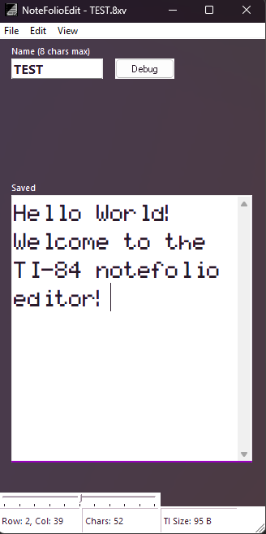

#  NoteFolioEdit

Edit and manage TI NoteFolio (.8xv) files easily — a simple tool for creating and modifying notes for TI calculators.
Designed for the TI-83 Plus / Ti-84 Plus (non CE) family. If you are lucky it might work on other models...

Running the app might require registering mscomctl.ocx. A .bat is provided to automate this process. 

More features and improvements will follow soon!
